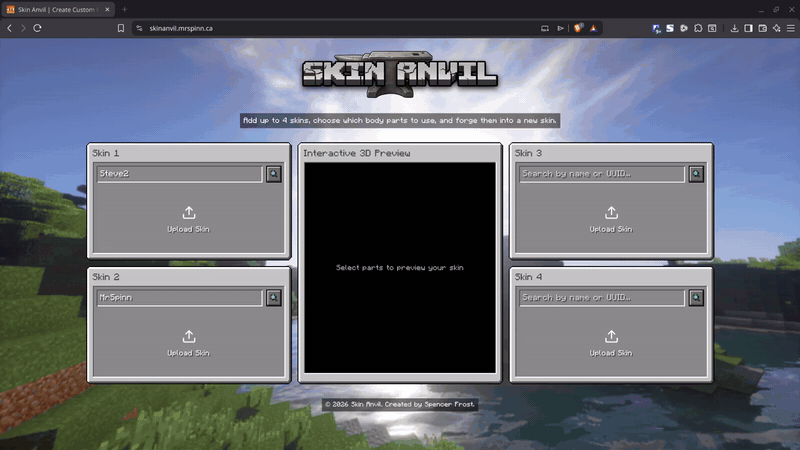

<div align="center">


**Merge and paint Minecraft skins entirely in the browser.**

[**Try it live →**](https://skinanvil.mrspinn.ca)

</div>

---

<div align="center">



</div>

## What it does

Skin Anvil lets you combine body parts from up to 4 different Minecraft skins into one composite skin, then fine-tune the result with a built-in paint editor before downloading it.

- **Load skins your way.** Upload skin files directly, or fetch any player's skin by username or UUID.
- **Mix and match parts.** Click a body part, pick which source skin it comes from, and watch the merged skin update instantly in both 2D and 3D.
- **Paint directly on the 3D model.** Open the editor and draw right onto the rotating character, or switch to a 2D pixel grid for precision work.
- **Real editing tools.** Pencil, eraser, flood fill, and eyedropper, with full undo/redo history and per-layer editing for the skin's overlay layers.
- **Download instantly.** The finished skin never touches a server. It's composited in your browser and saved straight to disk.

## Technical highlights

Everything interesting happens client-side. The backend is a thin Express proxy for skin lookups (browsers can't fetch skins cross-origin); merging, editing, previewing, and downloading involve **zero server round-trips**.

**Live canvas compositing.** Each body part maps to a rectangle in the standard 64x64 Minecraft skin layout. On every selection change, the merged skin is recomposited on an offscreen canvas by copying each part's texture region from its source skin, then handed to the previews as a data URL. A single constants module is the source of truth for part names, selector hit zones, and texture rectangles, so the selector UI, 2D preview, and compositor can never disagree.

**3D painting via UV raycasting.** The editor casts a ray from the cursor into the [skinview3d](https://github.com/bs-community/skinview3d) scene, filters hits to front-facing faces on the active layer (the overlay is double-sided, so naive raycasts land on interior walls), converts the hit's UV coordinates to a texel, and paints it. Drag strokes are interpolated with Bresenham's line algorithm so fast mouse movement doesn't leave gaps.

**An editing engine built on a document canvas.** While the editor is open, an offscreen 64x64 canvas is the single source of truth. Tools mutate it through pure pixel-math helpers (UV-to-texel mapping, flood fill, line rasterization), a version counter drives cheap re-renders, and undo/redo snapshots the pixel buffer. The base and overlay skin layers can be masked independently so you can edit a jacket without touching the skin underneath.

**One Three.js instance, carefully shared.** The paint raycaster must operate on skinview3d's scene graph, so `three` is pinned to the exact version skinview3d resolves. Two Three.js instances would mean raycasts against geometry from a different renderer, which fails silently.

## Architecture

```text
client/  React 18 + Vite 7
  hooks/useSkinManagement    skins + part-selection state
  hooks/useMergedSkinTexture client-side merge -> PNG data URL
  hooks/useSkinEditor        paint engine: tools, layers, history
  components/SkinEditor/     editor modal, 3D paint viewport, 2D pixel grid
  constants/skinParts.js     single source of truth for skin-layout geometry

server/  Express
  GET /api/fetch-skin/:name  proxies external skin lookup (validated)
  GET /api/health            health check
  + serves the built client in production
```

**Stack:** React 18, Vite 7, Three.js, skinview3d, Tailwind CSS, Express, Vitest.

## Running locally

Requires Node.js and npm.

```bash
git clone https://github.com/spencerfrost/skin-anvil.git
cd skin-anvil
npm run install-all   # installs root, client, and server deps
npm run dev           # client on :3000, server on :3004
```

Other commands:

```bash
npm run build         # production build (client + server)
npm run start         # serve the production build
npm run lint          # eslint across client and server
npm test --prefix client   # vitest suite
```

## License

MIT. See [LICENSE](LICENSE).

<div align="center">

Built by **Spencer Frost**

</div>
